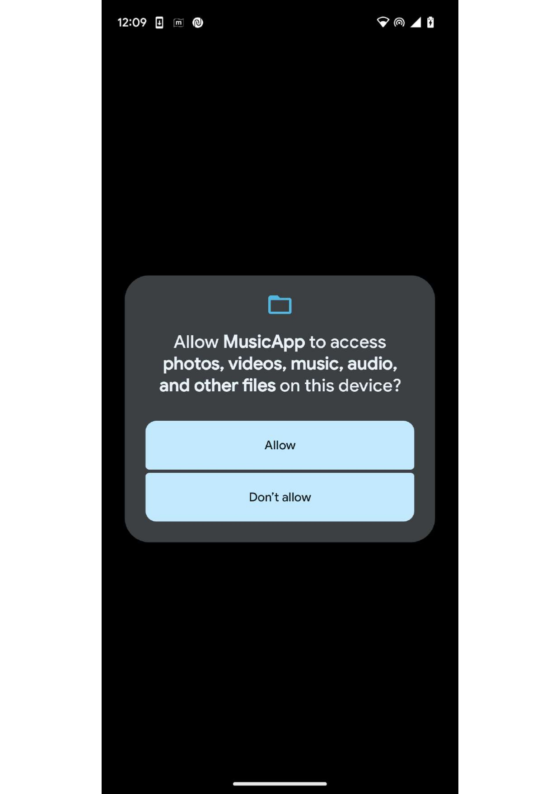
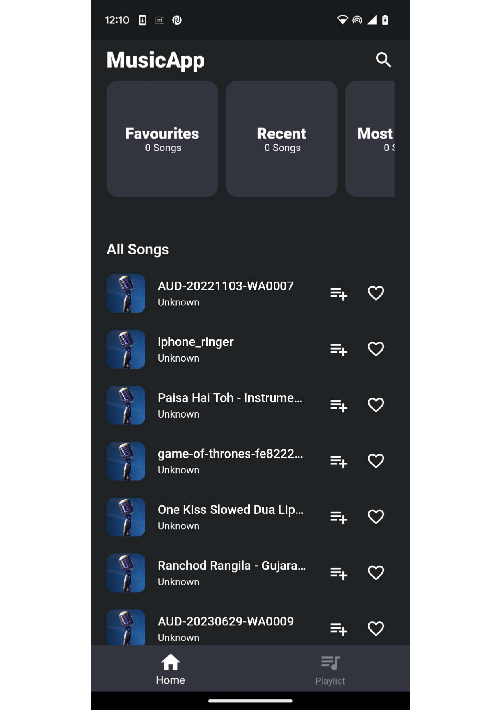
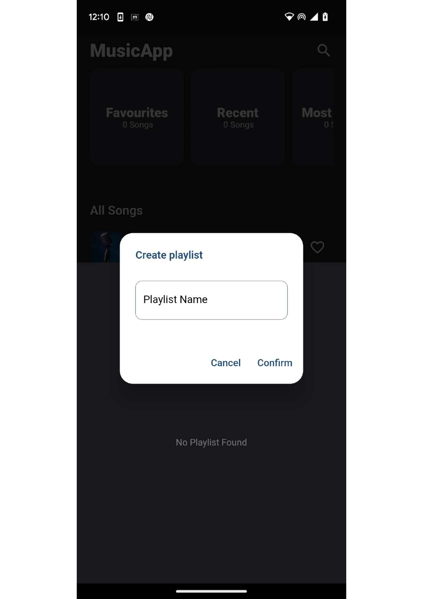
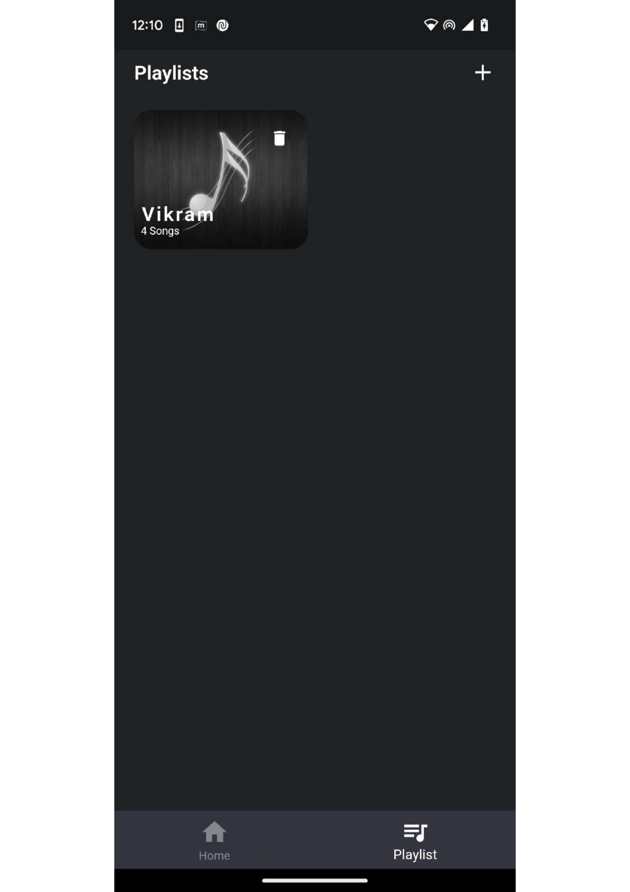
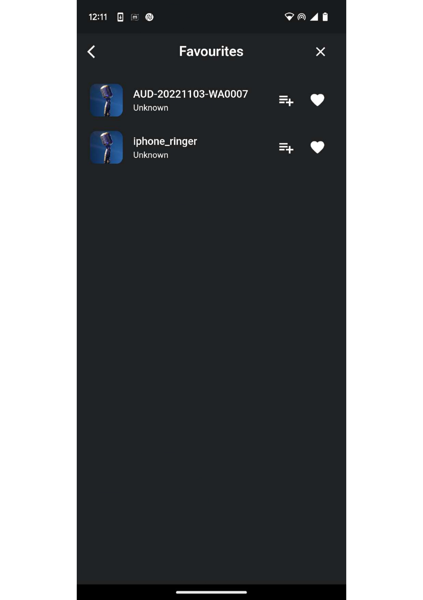
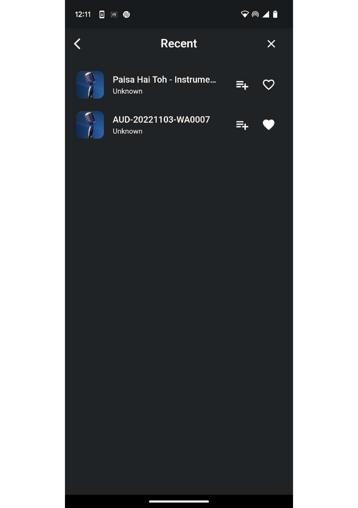
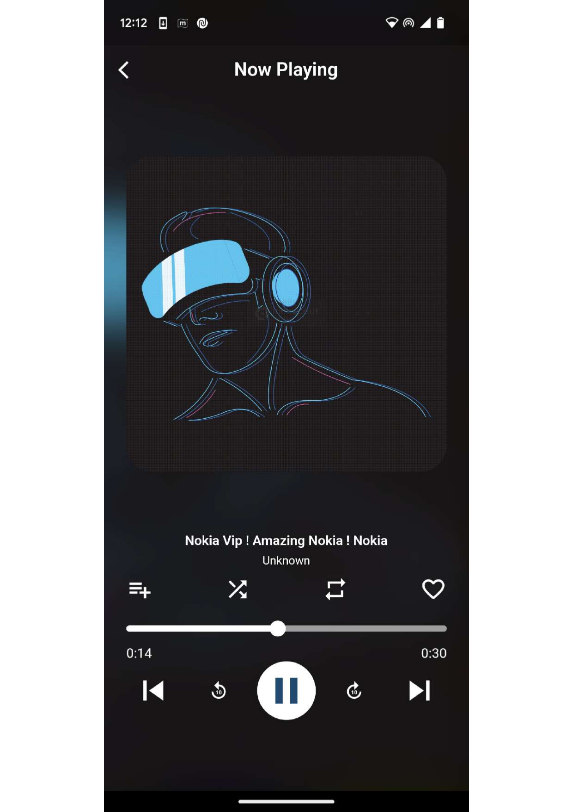

# MusicApp

MusicApp is a mobile application developed with Flutter that allows users to play locally stored music on their device. It utilizes Hive, a key-value paired database, to manage playlists and songs.

## Features

- **Local Music Playback**: Users can play music files stored on their device.
- **Playlist Management**: Users can create and manage their own playlists.
- **Playback Controls**: The app provides playback options such as play, pause, skip, and more.

## Requirements

- Flutter SDK
- Dart SDK
- Hive package

## Installation
1. Clone this repository:
   ```sh
   git clone https://github.com/vikrampatel0408/musicApp.git
2. Navigate to the project directory:
   ```sh
   cd musicApp
3. Install dependencies:
   ```sh
   flutter pub get
4.  Run the app:
    ```sh
    flutter run
## Usage

1. Launch the app on your device.
2. Browse and select the music files you want to add to your playlists.
3. Create playlists and add songs to them.
4. Use the playback controls to enjoy your music.

## Screenshots
Give the permission for allow access of storage and media files


Home Page



Create a playlist



See all playlist



Favourites Section



Recent Section


Now Playing 


